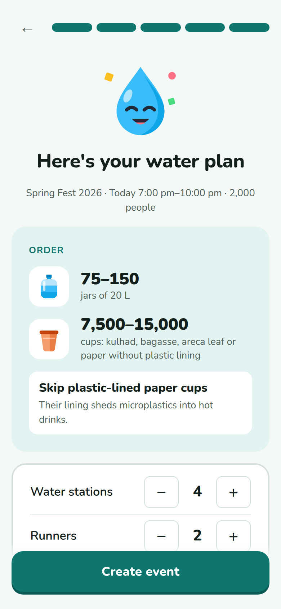
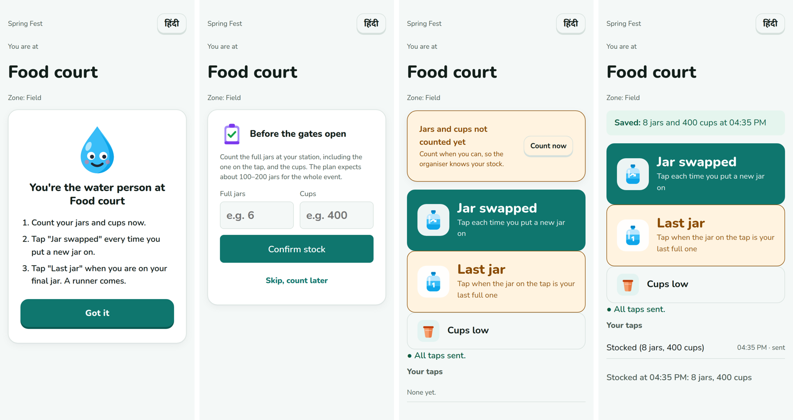
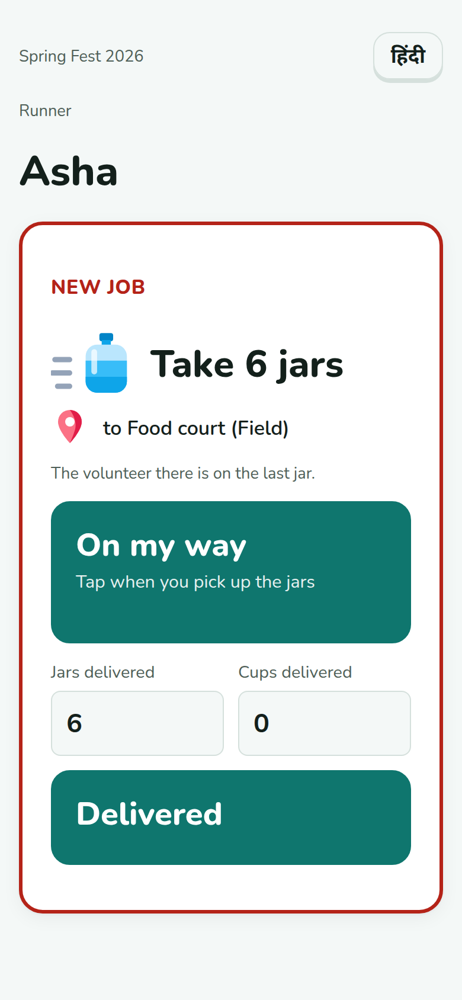
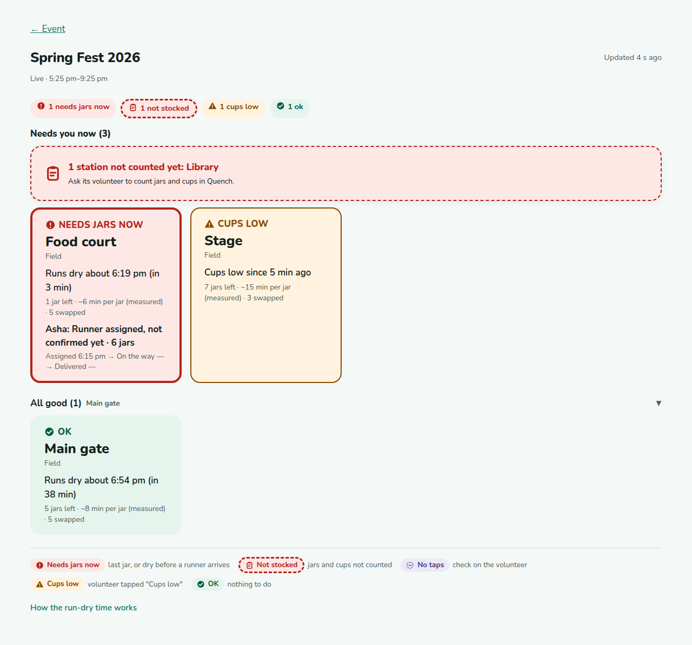
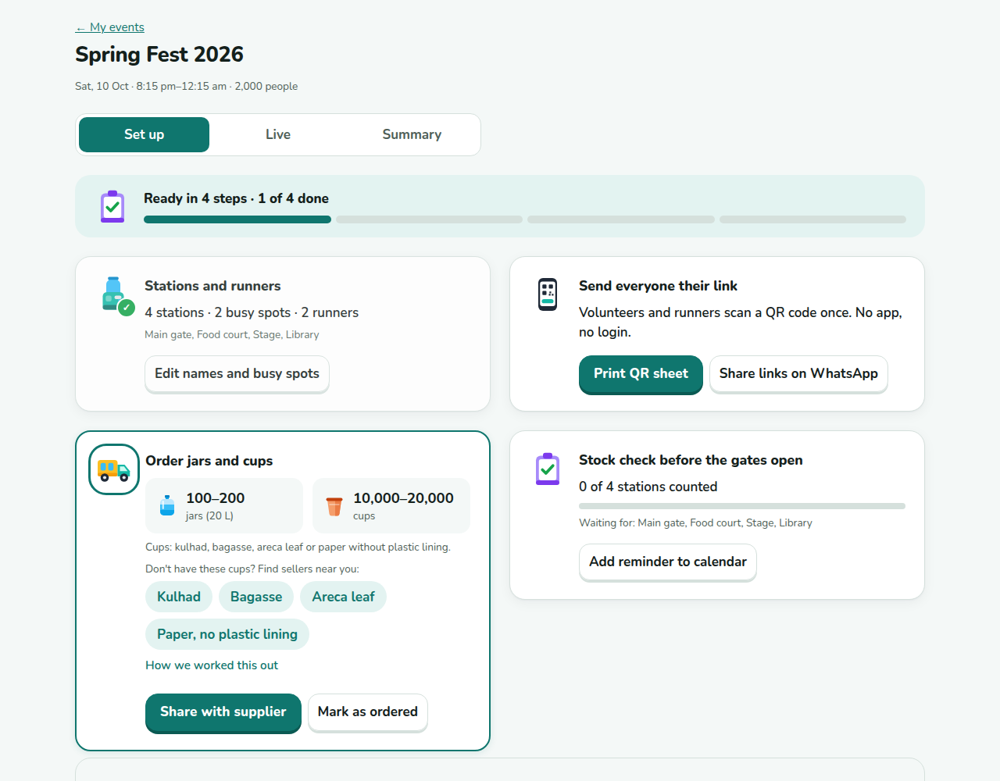
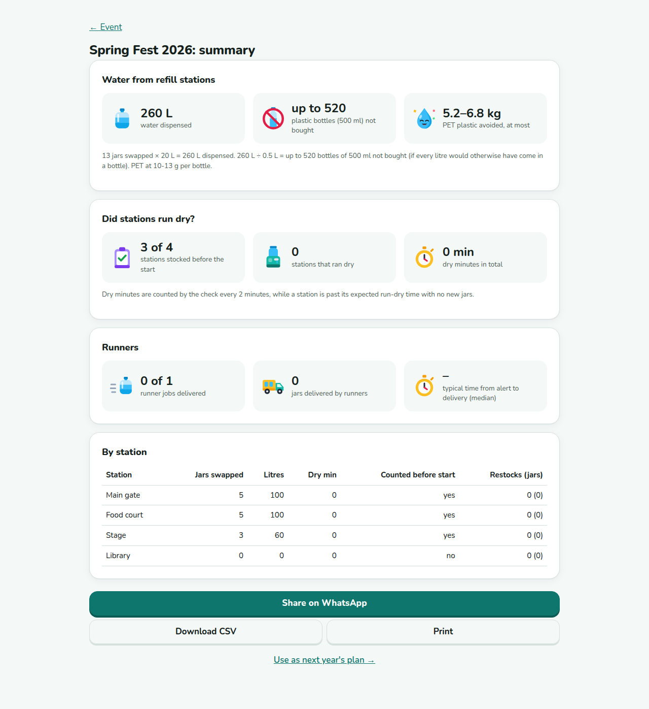

# Quench

Quench is a water control room for plastic-free events. When an event replaces plastic bottles with refill stations, Quench:
- plans how many 20 L jars and cups each station needs,
- checks every station is stocked before the gates open,
- predicts which station is about to run dry and sends a runner,
- gives the organiser the numbers at the end.

Built for Environmental Hacks (WeMakeDevs x AWS), Waste and Energy track, 8-11 Oct 2026.

**Live:** https://d3116g1xm6u7mg.cloudfront.net (AWS, ap-south-1 Mumbai)

**Tests:** 68 unit · 37 integration (API against DynamoDB Local) · 31 browser checks (headless Chrome), which pass both locally and against the deployed AWS site · load test: 500 taps in 30 s on AWS, 0 lost. How to run them: [Tests](#tests).

## Screenshots
| Set up: the water plan | Volunteer: one step at a time | Runner: a job |
|---|---|---|
|  |  |  |

**Live board (laptop).** Problems first. Food court is on its last jar and Asha has been assigned by Step Functions; stations nobody has counted are one card; OK stations fold away.



**Event hub: the set-up checklist** (stations, order, QR links, stock check) and the **summary** after the event.





Try it yourself: open the [live site](https://d3116g1xm6u7mg.cloudfront.net), set up an event, then open a station's QR link on your phone. [How it runs on AWS](https://d3116g1xm6u7mg.cloudfront.net/architecture.html).

## AWS design decisions

### Why each service
| Need | Service | Why this one |
|---|---|---|
| Volunteers tap at the peak, all at once | **API Gateway → SQS → Lambda** | The API only checks the tap and queues it (202), so a burst never waits on database writes. A consumer Lambda saves taps in batches of 10. Measured on AWS: 500 taps in 30 s, 0 lost. |
| A tap that cannot be saved must not vanish | **SQS dead-letter queue** | After 3 failed tries a tap moves to a dead-letter queue and is kept 14 days. `ReportBatchItemFailures` retries only the failed taps in a batch, not the whole batch. |
| "Which station runs dry next?" even when nobody is tapping | **EventBridge Scheduler → Lambda** | Every 2 minutes a Lambda projects each live station's run-dry time and flags quiet stations. There's no server to keep alive, and the board and the Lambda share the same code (`src/core/projection.js`). |
| A runner ignores a job | **Step Functions (Standard)** | Each job is one execution: assign → wait for "On my way" (3 min, else reassign) → wait for "Delivered" (45 min). The waits use task tokens, so nothing polls and nothing runs while waiting. A runner's tap resumes the execution. |
| Store events, stations, taps | **DynamoDB, on demand** | One table, one partition per event (`PK`/`SK`), so an event is one query. Live events are listed through `PK = EVENTS`, never a table scan. On-demand billing means an idle app costs nothing. |
| Website and API on one address | **S3 + CloudFront** | The site comes from a private S3 bucket (Origin Access Control); `/api/*` is forwarded to API Gateway. One https address, so phones need no CORS preflight and service workers work. |
| Infrastructure as code | **AWS SAM** | One `template.yaml`; `npm run deploy` builds it, `sam delete` removes all of it. |

All Lambdas run Node.js 22 on arm64 (Graviton: cheaper per millisecond than x86).

### Security
- **No passwords to leak.** The organiser's key is random and lives in their private link after `#`, so it never reaches server or CloudFront logs. Only its scrypt hash (with salt) is stored, and the API never returns it.
- **Each QR link has its own secret.** Volunteers and runners don't log in, so each station and runner has a random 16-character token in its QR link. The server checks it in constant time before a tap is queued. Runner actions also check that the job is assigned to that runner. Details: [Who can do what](#api).
- **Step Functions task tokens never leave AWS.** The runner's phone sends "Delivered" with its own link token, and the API looks up the task token server-side.
- **Least privilege per function** (`template.yaml`):
  - Every function can read and write only the Quench table.
  - Only the API can queue taps (send to the one queue).
  - Only the API, the projector and the tap consumer can start the dispatch state machine, and only that one.
  - The state machine can invoke only the dispatch function.
  - `states:SendTaskSuccess` has `Resource: '*'` because task tokens have no ARN to scope to. That's an AWS limitation, noted in the template.
- **Taps count exactly once.** Each tap has an id made on the phone. The tap and the station counters are written in one DynamoDB transaction that only succeeds if the id is new. Retries from the offline queue, SQS redelivery or a double tap change nothing.
- **Private bucket, https only:** S3 blocks all public access, and CloudFront redirects http to https.

### Cost
- **No always-on servers.** No EC2 and no RDS. The Lambdas aren't in a VPC, so there's no NAT gateway, which would bill by the hour even when idle. Everything is pay per request.
- **When nobody is using it:** the projector runs every 2 minutes, about 21,600 runs a month. That's well inside the Lambda free tier (1 million requests a month).
- **Real bill (Cost Explorer, 1-10 Oct 2026, Quench's services):**

  | Service | Usage cost |
  |---|---|
  | Step Functions | $0.68 |
  | DynamoDB | $0.02 |
  | S3, API Gateway, CloudFront, CloudWatch | under $0.01 |

  All of it was covered by AWS credits, so we paid $0.00. A zero-spend budget alerts on any real charge.
- **Lesson from the bill:** the Step Functions charge came from one bug on 9 Oct. Test events with no runners re-opened jobs in a loop, about 28,000 state transitions against a free tier of 4,000 a month. Fixed on 10 Oct:
  - Events with no runners get no jobs.
  - An execution starts only when a runner is free (waiting is free).
  - The tests delete their own events.
- **Not Quench:** the account also shows about $0.52 of EBS disk (1-9 Oct), which is from an earlier project in the same account. Quench has no EC2 or EBS.

## Status
- [x] Step 1: plan calculator (jars and cups per station per hour, low/high range, readiness check)
- [x] Step 2: save event (organiser PIN), manage stations and runners, printable station QR codes, volunteer station page
- [x] Step 3: volunteer taps ("Jar swapped", "Last jar", "Cups low"), each counted exactly once
- [x] Step 4: offline queue (taps saved on the phone first, sent when there is signal; page opens offline)
- [x] Step 5: live board (stations needing help first, refreshes every 5 s, warns when it stops updating)
- [x] Step 6: run-dry projection and quiet detection, computed every 2 minutes (EventBridge Scheduler → Lambda)
- [x] Step 7: start-of-event stock check (volunteer counts jars and cups; board flags stations not stocked)
- [x] Step 0: deployed on AWS (ap-south-1): CloudFront + S3 site, API Gateway + Lambda, DynamoDB, EventBridge Scheduler → projector Lambda, CloudWatch Logs
- [x] Step 8: runner dispatch with Step Functions (assign, "On my way", reassign on timeout, "Delivered" restocks)
- [x] Step 9: SQS tap queue with dead-letter queue (500 taps in 30 s on AWS, none lost)
- [x] Step 10: summary page (litres, "up to N bottles" with formula, dry minutes, runner jobs, CSV, reuse as next year's plan)
- [x] Step 11: simulation page: same evening with a WhatsApp group vs Quench (labelled simulation, assumptions on screen)
- [x] Step 12: Hindi on volunteer and runner screens, keyboard focus, light/dark checked

## Using it
1. **Set up** (`plan.html`): type the event name; tap the crowd size, day, start time and length. Quench suggests stations and runners and shows how many jars and cups to order. One button: **Create event**.
2. **Event hub** (`event.html`): three tabs.
   - **Set up**: a checklist that ticks itself: stations (rename, mark busy spots), order (share with supplier on WhatsApp), links (print QR sheet or share on WhatsApp), stock check (fills in as volunteers count).
   - **Live**: problems first; OK stations fold away.
   - **Summary**: water served, bottles avoided, runner times.
3. **No accounts or PIN.** Creating an event gives a private organiser link (`…#k=<key>`). The key sits after `#`, so it is never sent in the URL; the page sends it in a header and the server stores only its hash. The link is saved in "My events" on that device; "Send to myself" shares it to another device. Without it, the hub is view only.
4. **Volunteers and runners** open their own link or QR code. Add to home screen for an app-like icon (web app manifest).

## Architecture
| Piece | Local | AWS |
|---|---|---|
| Website | `python3 -m http.server` on `web/` | S3 + CloudFront (same address as the API) |
| Taps | written straight away | API → SQS → consumer Lambda (dead-letter queue after 3 tries) |
| Dispatch | assigned straight away; retried by the local scheduler | Step Functions state machine per job |
| API | `src/local/server.js` → Lambda handler | CloudFront `/api/*` → API Gateway (HTTP API) → Lambda (`src/api/handler.js`) |
| Data | DynamoDB Local (Docker) | DynamoDB (single table, `PK`/`SK`) |

## Run locally
Needs Node 20+, Python 3, Docker and Google Chrome (for the browser test).

```bash
npm install
npm run db:start     # DynamoDB Local in Docker (in memory, telemetry off)
npm run db:table     # create the table
npm run api          # API on http://localhost:3001 (separate terminal)
npm run serve        # site on http://localhost:8080 (separate terminal)
npm run scheduler    # projector every 2 min, like EventBridge Scheduler (optional, separate terminal)
```

Open http://localhost:8080. On a phone, use your laptop's Wi-Fi IP (e.g. `http://192.168.1.5:8080`). The site finds the API on port 3001 of the same host.

## Deploy to AWS
Needs an AWS profile with deploy rights (`samconfig.toml` uses profile `quenchsip`, region `ap-south-1`, stack `quench`).

```bash
npm run deploy       # sam build + sam deploy: DynamoDB, API Gateway + Lambda, projector Lambda + EventBridge schedule, S3 + CloudFront
npm run deploy:web   # upload web/ to S3 and clear the CloudFront cache; prints the site address
python3 scripts/clear_test_events.py        # list test events in the live table (add --yes to delete them)
```

The site and the API share one CloudFront address: the site from S3, and `/api/*` forwarded to API Gateway. The page uses `/api` when it is not on localhost or a Wi-Fi address, so nothing needs configuring after deploy. Remove everything with `sam delete`.

## Tests
```bash
npm test             # unit (68): plan maths, projection, dispatch, validation, key hashing
npm run test:int     # integration (37): API handler against DynamoDB Local
npm run test:e2e     # browser (31 checks): plan, PIN, QR, taps, offline, Hindi, board, stock, dispatch, summary (needs api + serve running)
node scripts/load-test.mjs https://<site>/api 500 30   # 500 taps in 30 s, checks none are lost
# against the deployed site:
WEB_URL=https://<site> API_URL=https://<site>/api npm run test:e2e
```

## Layout
```
src/core/     pure logic shared by browser and Lambda (plan.js, event.js)
src/lib/      DynamoDB access, events, PIN hashing (Node only)
src/api/      Lambda handler (HTTP API, payload v2)
src/local/    local dev server around the handler
scripts/      create-table.js for DynamoDB Local
web/          static site (plan, event, qr, v = volunteer, r = runner, board, summary)
docs/screenshots/   images used in this README
test/ itest/ e2e/   unit, integration, browser tests
template.yaml SAM template
```

## Data model (one partition per event)
| SK | Item |
|---|---|
| `META` | event settings, organiser PIN hash (scrypt + salt, never returned by the API) |
| `STN#<id>` | station: name, zone, stock |
| `RUN#<id>` | runner: name, status |
| `TAP#<uuid>` | volunteer tap: type, station, when it happened (phone clock, checked), when received |

The plan is computed when the event is read, so it always matches the current stations.

**Taps count exactly once.** Each tap gets a random id on the phone. Storing the tap and updating the station's counters happen in one DynamoDB transaction, and the tap is stored only if its id is new. A retried tap is answered `200 duplicate` and changes nothing. Pressing the same button twice within 3 seconds counts as one tap.

**Taps survive no signal.** A tap is saved in the phone's IndexedDB before it is sent. Waiting taps are sent oldest first, retried with backoff (1 s, 2 s, 4 s … 30 s), and again when the phone comes back online or the page is reopened. The volunteer sees "3 taps saved on this phone, waiting to send" or "All taps sent". A service worker lets the station page open with no signal, but browsers allow it only on https or localhost, so on the deployed (https) site and not over plain-http Wi-Fi testing.

**Live board** (`board.html?e=<id>`). One tile per station, most urgent first:
| Status | When |
|---|---|
| Needs jars now | the volunteer tapped "Last jar" (stays on until a restock) |
| Not stocked | the volunteer has not counted and confirmed jars and cups (a recount replaces the earlier count) |
| No taps: check on volunteer | the event is live and nobody has tapped for 1.5× the planned time per jar (low estimate), at least 10 min |
| Cups low | the volunteer tapped "Cups low" |
| OK | none of the above |

Each status has its own colour and its words on the tile, so it does not rely on colour alone.

**Run-dry projection** (`src/core/projection.js`, shared by the board and the scheduled Lambda so they always agree):
- Minutes per jar = average of the last 3 gaps between swaps; until a station has two swaps, the plan's busy estimate.
- Jars left = from whichever is newer, the "Last jar" tap (1) or the stock count (counted jars), minus swaps since, plus jars restocked since. Otherwise "not known yet".
- The jar on the tap is full at the stock count, so the dry time counts from the later of the last swap and the count.
- Runs dry at = last swap + jars left × minutes per jar.
- Alert when it runs dry sooner than the runner's trip time + 10 minutes.
- Quiet when nobody has tapped for 1.5× minutes per jar (at least 10).

Every 2 minutes, **EventBridge Scheduler** runs the projector Lambda (`src/api/projector.js`). It finds live events through an index (`PK = EVENTS`, no table scan), saves each station's projection and `alertSince`, and logs one JSON line per run to CloudWatch. Locally, `npm run scheduler` does the same on a timer.

**Runner dispatch** (`src/lib/dispatch.js`, state machine in `template.yaml`). When a station needs jars (a "Last jar" tap, or the projection says it runs dry before a runner could get there) and has no open job, a job is opened and a Step Functions execution starts:
assign the free runner who has waited longest. The state machine starts only when a runner is free: if all are busy the job waits ("Waiting for a free runner" on the board) and the 2-minute check starts it once one is free, so waiting costs no state transitions. Events with no runners get no jobs. If the free runner is taken at the same moment, it retries every 60 s for about 10 min → wait for "On my way" (180 s, then reassign to someone else) → wait for "Delivered" (45 min, then close as not confirmed). The runner's taps resume the execution with its task token (never sent to browsers). "Delivered" restocks the station, which clears "Last jar" and moves the run-dry time. How many jars: about an hour at the station's rate minus what is left, 1 to 6.

**Summary** (`summary.html?e=<id>`): litres = jars swapped × 20; "up to N bottles" = litres ÷ 0.5, PET at 10-13 g per bottle; dry minutes (added up by the scheduled check while a station is past its run-dry time); stations stocked before the start; runner jobs and median times; CSV download; "Use as next year's plan".

**Simulation** (`demo.html`, `src/core/sim.js`): the same 3-hour evening minute by minute, with a WhatsApp group (volunteers message on last jar sometimes and when empty; the lead reads after a delay) and with Quench (real projection code, missed taps modelled). Over 20 evenings: typical group 83 vs Quench 10 dry station-minutes at 90% taps; a very disciplined group 20 vs 11; at 70% taps the disciplined group does as well or better. These are model results, not event data.

## API
| Method | Path | Who |
|---|---|---|
| GET | `/health` | anyone |
| POST | `/events` | organiser (returns the organiser key for their private link) |
| GET | `/events/{id}` | anyone with the link; with `x-organiser-key` it also returns each station's and runner's link token |
| PATCH, POST, DELETE | `/events/{id}`, `/events/{id}/stations[/{sid}]`, `/events/{id}/runners[/{rid}]` | organiser (`x-organiser-key`, or `x-organiser-pin` for older events) |
| GET | `/events/{id}/stations/{sid}/link` | volunteer: checks their link on page load |
| POST | `/events/{id}/stations/{sid}/taps` | volunteer (`x-access-token` from the station QR link); 202 when queued on AWS |
| GET | `/events/{id}/summary` | anyone with the link |
| GET | `/events/{id}/runners/{rid}` | runner (`x-access-token` from the runner link) |
| POST | `/events/{id}/jobs/{jid}/ack`, `/events/{id}/jobs/{jid}/done` | the assigned runner, with their token |

**Who can do what (no logins, by design: volunteers and runners just scan a QR code).**
- **Organiser:** a random key in their private link (`#k=…`, after the `#` so it never reaches server logs). Only its scrypt hash is stored.
- **Volunteers and runners:** station and runner ids are public (the board shows them), so an id alone grants nothing. Each station and runner has its own random 16-character token, only in their QR link (`&t=…`).
  - The server checks the token, compared in constant time, before a tap is queued and on every runner action.
  - On top of that, "On my way" and "Delivered" are refused unless the job is assigned to that runner.
  - A copied link without its token, or someone else's token, gets 403.
- Tokens are only returned to the organiser (they print the QR codes). Stations and runners from before tokens existed have none and stay open, so links already printed keep working.
- Step Functions task tokens never leave the server.
- **Before real users:**
  - Role policies with Cedar, so it's one policy file instead of checks in code.
  - Token rotation (a new QR code if one leaks).
  - Rate limits on the public routes.
  - CloudWatch log retention (logs are kept forever by default).
  - Left out of the hackathon build on purpose, so judges can try every role from their own event.

## Assumptions in the plan
| Value | Default | Source |
|---|---|---|
| Water per person per hour | 0.25-0.5 L | High: government advisory for outdoor summer events (500 ml per person per hour). Low: our assumption |
| Weather factor | 1 / 1.3 / 1.6 | Our assumption |
| Cup size | 200 ml | Our assumption |
| Stations | 1 per 500 people | Northern Territory (Australia) public-event guidance |

## AI tools used
- Claude Code (Anthropic): planning, code and tests, reviewed by the team.
